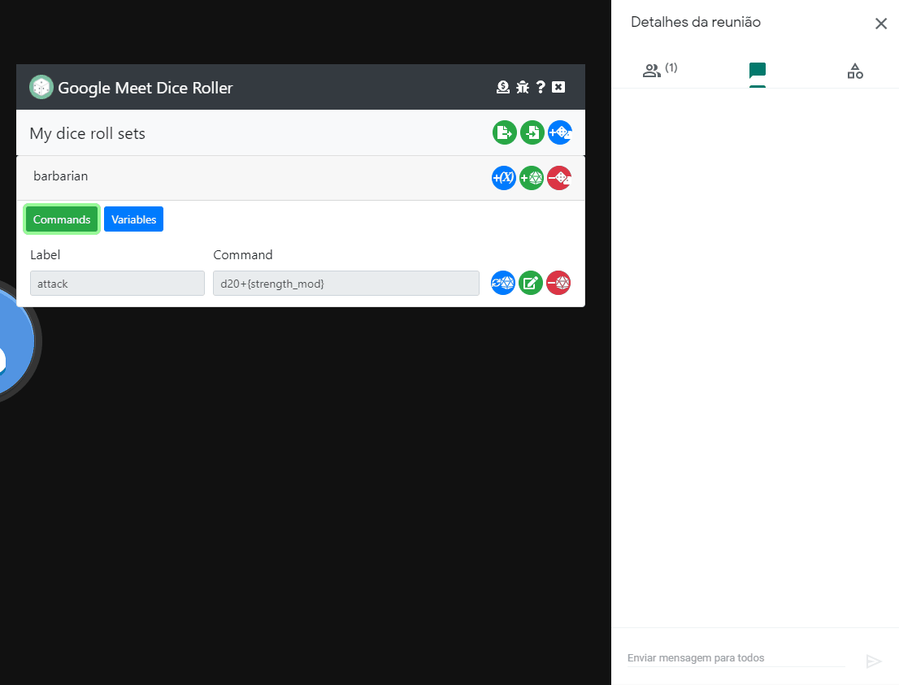
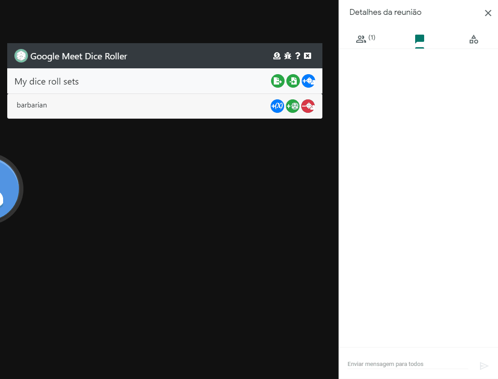

# Google Meet Dice Roller
Dice roller extension for RPG players using Google Meet on Google Chrome or Microsoft Edge (Heyyyy!!! It works!)

[Chrome Store Page](https://chrome.google.com/webstore/detail/google-meet-dice-roller/lpmdpndjiddedlpjgomjhpgmkaochlkg)

If you're seeing this page, probably the Google Meet Dice Roller extension was just installed or updated... Better read these docs to keep up with changes.

# The "Browsing History Access" permission is no longer necessary

On the previous version, the "Roll Dice!" button in the user interface used to use the [chrome tabs api](https://developer.chrome.com/docs/extensions/reference/tabs/). By simply requesting access to use this api, the extension was marked as "requiring browser history".

This api isn't necessary anymore, so the extension will no longer require access to browsing history.

## For Microsoft Edge Users

On Edge, after the extension is installed or updated, a white halo may apear surrounding the extension icon in the toolbar. This means you need to give permission to the extension to access Google Meet. To do that, simply click on the icon.

## Basic Usage

In Google Meet's chat window's text input, use the **/r** or **roll** commands and hit **Enter** to roll dice.

#### Command Examples:

    roll d6                 (rolls one six sided dice, the number of sides can be any positive integer number)
    
    /r d6                   (rolls one six sided dice, the number of sides can be any positive integer number)
    
    /r d6+10                (rolls one six sided dice and adds 10 to the result)
    
    /r 5d6                  (rolls five six sided dice and sums the results)
    
    /r 5d6+10               (rolls five six sided dice, sums the results and adds 10)
    
    /r 5d6-10               (rolls five six sided dice, sums the results and subtracts 10)

    /r 5d6*10               (rolls five six sided dice, sums the results then multiplies the result by 10)
    
    /r 5d6h2                (rolls five six sided dice and sums the results of the two highest values. "h" stands for "Highest")
    
    /r 5d6l2                (rolls five six sided dice and sums the results of the two lowest values. "l" stands for "Lowest")
    
    /r 5d6h2+10             (rolls five six sided dice, sums the results of the two highest values and adds 10)
    
    /r 5d6d3                (rolls five six sided dice, sums the results then counts how many results are equal or higher than 3. "d" stands for "Difficulty")
    
    /r 5d6m3                (rolls five six sided dice, sums the results then counts how many results are equal or lower than 3. "m" stands for "liMit")
    
    /r 5d6t20               (rolls five six sided dice, sums the results and shows SUCCESS if the sum is equal or higher than 20. "t" stands for "Target")
    
    /r 5d6n20               (rolls five six sided dice, sums the results and shows SUCCESS if the sum is equal or lower than 20. "n" stands for "Negate")
    
    /r 5d6+10t20            (rolls five six sided dice, sums the results, adds 10, and shows SUCCESS if the sum is equal or higher than 20)
    
    /r 5d6+10n20            (rolls five six sided dice, sums the results, adds 10, and shows SUCCESS if the sum is equal or lower than 20)
    
    /r 5d6h2+10t20          (rolls five six sided dice, sums the results of the two highest values, adds 10, and shows SUCCESS if the sum is equal or higher than 20)
    
    /r 5d6l2+10t20          (rolls five six sided dice, sums the results of the two lowest values, adds 10, and shows SUCCESS if the sum is equal or lower than 20)
    
    /r 2d6 +3d12 -4d4 +10   (rolls and sums the results of two six sided dice, adds the sum of results of three twelve sided dice, subtracts the sum of result of four four sided dice, then adds 10 to the final result)

You can type any positive integer for the dice "faces". You can use the traditionals **d2, d4, d6, d8, d10, d12, d20, d100** or just funcky stuff like **d37, d23, d145, ETC...**

## User Interface

**The user interface can be used in the Google Meet's page itself.** 

On the user interface you can create new **dice roll sets**, **dice roll commands** and **variables/epxressions**.

Set names, commands labels and variables labels **can't contain spaces, tabs** and the following characters: `. + - * / \ {} () []`.

## Creating dice roll sets

You can create a **collection** of **dice roll sets** on the user interface. Each set has a **name**, and **the set name should be unique** among the sets in your collection.

## Creating dice roll commands

Dice roll sets can have many **dice roll commands**. Commands in a set have a **label** that also **should be unique** among commands in the same set. Commands in the dice roll set should be **valid commands** like the ones in the *Command Examples* section above, **without** the **/r** or **roll** parts. **Also dice roll commands can use variables/expressions (see bellow).**

## Creating variables/expressions

Dice roll sets can now have variables. **Variables are numbers or simple mathematical expressions that can be used in your dice roll commands.** Think of them as the character's attributes in the character sheet.

Variables can be:
- **Integer numbers** like 1, 20, -34, etc...
- **Mathematical expressions** like:
  - `1+2`
  - `2-1`
  - `-30+40`
  - `1+2+3+4`
  - `1*2+3+4`
  - `1*(2+3)-4`
  - `10/(3-1)`
  - `round(10/3)`
  - `floor(10/3)`
  - `ceil(10/3)`
  - `round(10/3)+4*(ceil(20+(50-2)*6))` (i think no one will use something THAT complicated)

You can create expressions using the mathematical operators `+ - * and /` (adding, subtracting, multiplying and dividing). You can also use the functions `round(), ceil() and floor()`. 

The operators are evaluated from left to right, with multiplication and division operations having a higher precedence than additions and subtractions. As in school mathematics, wrap sub expressions with `()` to change operation precedence.

**Other variables can also be used in expressions**. For that you need to wrap the variable label in `{}`.  So something like `10*{other_variable}+3*{also_another_variable}` is also a valid expression. **An expression can never call itself or make another expression call itself.**

**Expressions should always return an integer number.**

Expressions are evaluated by the [Math.js](https://mathjs.org/) library.

## Using variables/expressions on dice roll commands

Variables/expression can be used with dice roll commands on the **"dice count" part**, the **"constant" part** of the commands or the `h`,`l`,`t`,`m`,`d` and `n` options. For instance, on the command `10d6+5`, `10` is the **"dice count"** and `+5` is the **"constant"**.

You can use more than one variables and mix variables with numbers on those parts like the examples bellow:

- `1d12+{strength_mod}`
- `1d12+{strength_mod}+{weapon_mod}`
- `{charisma}d10`
- `{dexterity}+{firearms}d10`
- `1d12+{strength_mod}+20`
- `1d12+{strength_mod}+{weapon_mod}+20`
- `{dexterity}+{firearms}+2d10`
- `5d6h{high_pool}`
- `5d10d{standard_difficulty}`
- `1d100n{strength}`

The allowed operators on the **"dice count"** part are `+ -`, and on the **"constant part"** are `+ - *`. 

## Editing dice roll commands and variables/expressions

You can **edit** a dice roll commands and variables/expressions using the **green/edit button**. While in edit mode, other buttons will apear for confirming or canceling the changes.

## Deleting stuff

You can delete dice roll sets, commands and variables/expressions using their corresponding red/minus buttons. A pop up will always ask for confirmation before delete.

## Export and import data

You can backup you dice roll collection using the new backup button. The backup data is a **json** object. Since the extension can't access the file system, you need to copy the data and save somewhere using notepad or any other text editor.

You can restore a previously saved backup, or import someone else's dice roll collection, using the importe button besides the backup button. **This operation won't replace your collection with another one, it will add the imported data to your existing collection.**. If there are conflicts with dice roll sets names, commands or variables labels, the existing ones on your collection won't be replaced. 

The imported data should be a valid dice roll collection. **All set names, labels, commands and variables will be validated.**

## Using saved dice roll commands

A saved dice roll command can be used in two ways:
- In Google Meet's chat window's text input by typing  **/r** or **roll** followed by **{set name}.{command label}**. So to roll the *attack* command of the *barbarian* set, type **/r barbarian.attack**

- Simply use the blue "**roll dice button**" besides the commands **while Google Meet's chat area is visible**.

Probably you've noticed that **the idea is for a dice set to represent a character and the command in the dice set to represent the character's actions**.

## Help, bug reports and feature requests

The best place for help, bug reports and feature requets is the [project's issues page](https://github.com/rafaelvascc/google-meet-dice-roller/issues). **I strongly prefer tracking issues in github instead of reading emails**. Even because other users might help as well.

On the UI's header, there are buttons/links for bug report and feature requests (that leads to the [project's issues page](https://github.com/rafaelvascc/google-meet-dice-roller/issues)) and a help/docs button that leads to this README.md file.

## Donations

I created this extension primary for me and my RPG group, then I decided to distribute it for free because "why not?". 

I have no intention to charge for it's use. First because only a very small amount of people would pay for it and a lot of RPG players would like to use it but can't or won't pay. So I just prefer to leave it free and let everyone enjoy.

Second, I don't want to turn something I made for myself, for fun and to mess with React, into a side/second job.

If you liked the extension and are feeling generous, on the UI's header there is a **Donate** button. You may send me money for a coffee with it or just use the "donate" button bellow. If you're feeling REALLY generous, you can send me enough for a RTX 3080. :grin:

Se você for do Brasil, pode doar usando o Pix. (If you're from Brazil you can donate using Pix)

`f49d2b33-4446-4c95-99b7-816623c8be32`

Since I'm too lazy to see emails and thank each one that donated, I will leave a great **"Thanks"** here in advance.

# Changelog

## [1.2.0] - 2021-06-20

### Added
- Added the possibility to use variables with the `h`,`l`,`t`,`m`,`d` and `n` options as requested [here](https://github.com/rafaelvascc/google-meet-dice-roller/issues/8)

## [1.1.1] - 2021-06-19

### Fixes
- Fixed issue with constant calculations as reported [here](https://github.com/rafaelvascc/google-meet-dice-roller/issues/4) 
- Fixed navigation scrolling as requested [here](https://github.com/rafaelvascc/google-meet-dice-roller/issues/5) 

## [1.1.0] - 2021-06-05

### Added
- Backup/restore functionality
- Variables/expressions
  
### Changed
- UI is now attached to Google Meet's page
- No more dependent from the chrome.tabs api
- Using hash tables based data instead of arrays
- Many React components improvements 
  
### Fixes
- Using a new dice roll function based on the [MDN's Math.random() docs](https://developer.mozilla.org/en-US/docs/Web/JavaScript/Reference/Global_Objects/Math/random).  

## [1.0.1] - 2021-05-24

### Fixes
- Fixed header buttons tooltips 

## [1.0.0] - 2021-05-23

### Added
- Added user interface for creating dice roll sets
- Added "multiply" option to dice roll calculations 

### Changed
- Better docs
- Showing the roll "label" if a saved dice roll is used

## [0.0.0.2] - 2020-07-22

### Fixes
- Fixed subtracting constant value in commands like /r 2d6-1 

# Planned features (no date yet)
- Add a "options" tab with some requested options like "Sort rolled dice: {true} or {false}"
